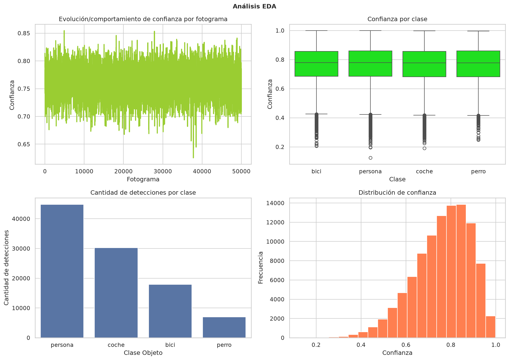

# Informe EDA — VizionarIA

## Resumen del dataset
- Detecciones analizadas: 100000
- Clase predominante: persona

## Distribución de clases
- persona: 44819
- coche: 30216
- bici: 17952
- perro: 7013

## Distribución global de confianza
- Media: 0.7621
- Mediana: 0.7789
- Q1: 0.6832
- Q3: 0.8579
- Desviación estándar: 0.1254

## Confianza por clase
- bici: 0.7619
- coche: 0.7609
- perro: 0.7619
- persona: 0.7629

## Relación temporal
- Correlación confianza-fotograma: 0.0001
- No se observa una relación lineal relevante entre fotograma y confianza.

## Panel EDA

## Conclusiones
- La clase predominante es persona.
- Las medias de confianza por clase son muy similares entre sí.
- La distribución de confianza presenta una dispersión moderada.
- No se observa una tendencia lineal clara con el avance de los fotogramas.